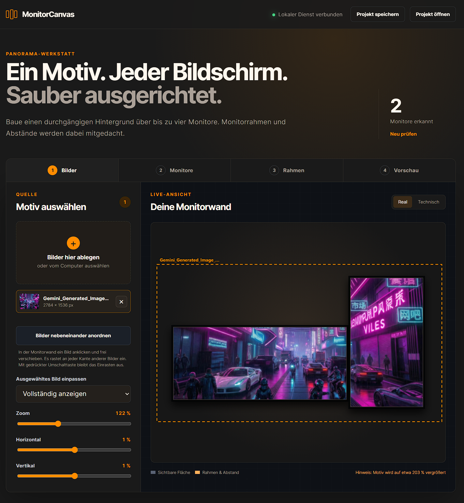
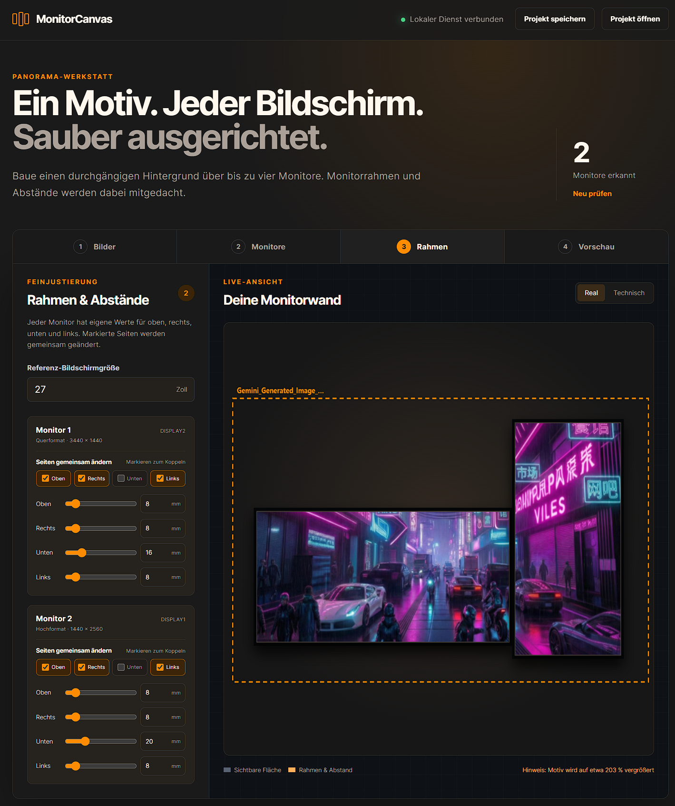

<div align="center">

# MonitorCanvas

**Ein Motiv über bis zu vier Windows-Monitore, sauber über Rahmen und Höhenversätze ausgerichtet.**

[](https://github.com/TomMen74/MonitorCanvas)
[](LICENSE.txt)
[](https://github.com/TomMen74/MonitorCanvas/releases/latest)

## [MonitorCanvas für Windows herunterladen](https://github.com/TomMen74/MonitorCanvas/releases/latest)

</div>

---

## Was ist MonitorCanvas?

MonitorCanvas erstellt ein zusammenhängendes Hintergrundbild für eine
Monitorwand. Dabei werden nicht nur Auflösung und Systemposition, sondern auch
die echten Monitorrahmen, unterschiedliche Höhen und Hochformat-Monitore
berücksichtigt.

Die Bedienung läuft im Browser. Alle Bilder und Einstellungen bleiben lokal
auf dem eigenen Computer.

<div align="center">



*Bilder auswählen, direkt in der Monitorwand positionieren und in Echtzeit prüfen.*

</div>

## Installation

Unter [Releases](https://github.com/TomMen74/MonitorCanvas/releases/latest)
stehen die fertigen Windows-Dateien gut sichtbar zum Download bereit:

| Variante | Geeignet für | Verwendung |
|---|---|---|
| **Setup.exe** | normale Installation | herunterladen, doppelklicken, installieren |
| **Portable.zip** | USB-Stick oder Rechner ohne Installation | entpacken und `MonitorCanvas.exe` starten |

Für die meisten Nutzer ist die Datei mit **`Setup.exe`** am einfachsten.

Es werden weder Python noch Node.js benötigt. MonitorCanvas nutzt ausschließlich
Bestandteile, die unter Windows 10 und Windows 11 vorhanden sind.

Solange die Installationsdatei noch nicht digital signiert ist, kann Windows
SmartScreen vor dem ersten Start eine Sicherheitsabfrage anzeigen. Die Pakete
werden öffentlich und reproduzierbar durch GitHub Actions aus diesem Quellcode
erstellt.

## Funktionen

- automatische Erkennung von bis zu vier Windows-Monitoren
- Unterstützung für Querformat, Hochformat und negative Bildschirmkoordinaten
- vertikaler Versatz für die reale Höhe jedes Monitors
- eigene Rahmenbreiten für oben, rechts, unten und links
- Kopplung beliebiger Rahmenseiten für gemeinsame Änderungen
- mehrere Quellbilder automatisch anordnen und frei zusammenfügen
- Bilder direkt in der Vorschau verschieben und an Kanten einrasten
- KI-Prompt-Assistent passend zur erkannten Monitorwand
- automatische Empfehlung für Seitenverhältnis und Bildauflösung
- herunterladbare Kompositionsmaske für externe Bildgeneratoren
- Echtzeitvorschau mit realer und technischer Ansicht
- automatische Wiederherstellung der letzten Sitzung
- PNG-Export in der Größe des virtuellen Windows-Desktops
- direkte Übernahme als Windows-Hintergrund

## Teststatus

**Version 1.0.0** wurde im realen Betrieb mit zwei Monitoren getestet,
einschließlich einer gemischten Anordnung aus Quer- und Hochformat.

Die Anwendung und ihre Berechnungslogik sind für bis zu vier Monitore
ausgelegt. Der Betrieb mit drei oder vier gleichzeitig angeschlossenen
Monitoren konnte mangels entsprechender Testhardware bisher noch nicht
praktisch bestätigt werden.

## KI-Wallpaper planen

Der integrierte Assistent benötigt kein KI-Konto und keinen API-Schlüssel.
Aus Motiv, Stil und gewünschter Stimmung entsteht ein fertiger Prompt, der die
erkannte Monitoranordnung, Hochformatbereiche, Rahmenübergänge und sichere
Positionen für wichtige Bildinhalte berücksichtigt.

MonitorCanvas empfiehlt außerdem eine native Mindestauflösung und eine ideale
Generierungsgröße. Eine passende Kompositionsmaske kann als PNG heruntergeladen
und bei einem externen Bildgenerator als visuelle Referenz verwendet werden.

## Rahmen präzise einstellen

Jeder erkannte Monitor besitzt eigene Werte für oben, rechts, unten und links.
Beliebige Seiten können gekoppelt und dann gemeinsam per Regler oder direkter
Millimeter-Eingabe geändert werden. Das funktioniert auch bei gemischtem Quer-
und Hochformat.

<div align="center">



*Eigene Rahmenwerte je Monitor und Seite, inklusive Hochformat-Unterstützung.*

</div>

## Bedienung

1. Bilder auswählen oder in die Anwendung ziehen.
2. Die erkannte Monitoranordnung kontrollieren.
3. Höhenversätze und Rahmenbreiten in Millimetern einstellen.
4. Bilder in der Monitorwand verschieben und zusammenfügen.
5. Das Ergebnis als PNG speichern oder direkt als Hintergrund übernehmen.

## So funktioniert die Rahmenkorrektur

Bei nebeneinanderliegenden Monitoren addiert MonitorCanvas den rechten Rahmen
des linken Monitors und den linken Rahmen des rechten Monitors. Bei
übereinanderliegenden Geräten werden der untere und obere Rahmen addiert.

Die Umrechnung von Millimetern in Pixel erfolgt anhand der eingetragenen
Bildschirmdiagonale. So überspringt das Motiv genau den Bereich, der durch die
physischen Monitorrahmen verdeckt wird.

## Datenschutz

- keine Cloud-Verarbeitung
- keine Übertragung der Quellbilder
- lokaler Dienst ausschließlich unter `127.0.0.1`
- Bilder und Einstellungen bleiben im Browser des eigenen Rechners
- keine Administratorrechte für die Installation erforderlich

## Entwicklung

Für einen direkten Start aus dem Quellcode genügt unter Windows ein Doppelklick
auf `start.bat`.

Neue Windows-Pakete werden über GitHub Actions gebaut. Der Workflow
**Windows-Pakete erstellen** kann auf GitHub manuell mit einer Versionsnummer
gestartet werden. Ein Versions-Tag wie `v1.0.0` erstellt zusätzlich automatisch
ein öffentliches GitHub Release:

```text
MonitorCanvas-1.0.0-Setup.exe
MonitorCanvas-1.0.0-Portable.zip
```

## Lizenz

MonitorCanvas steht unter der [MIT-Lizenz](LICENSE.txt).
